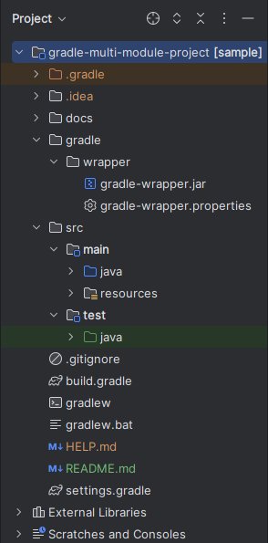
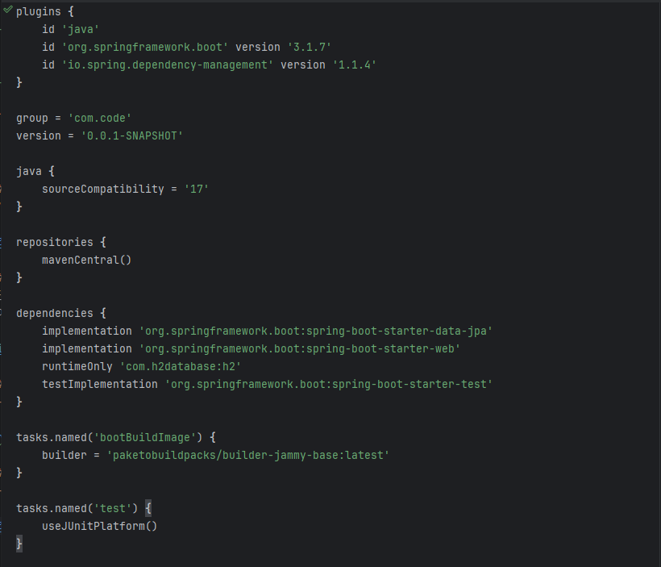
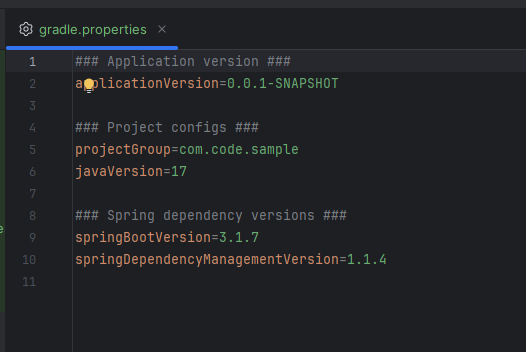
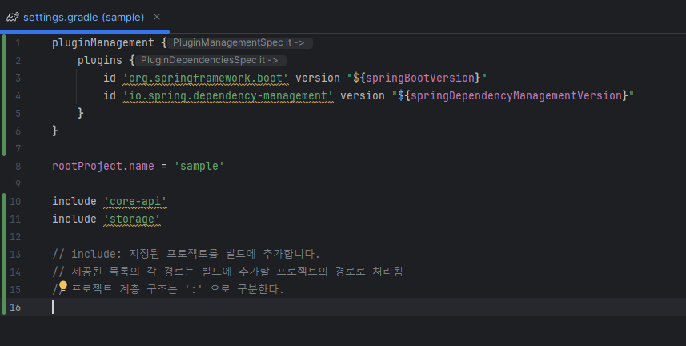
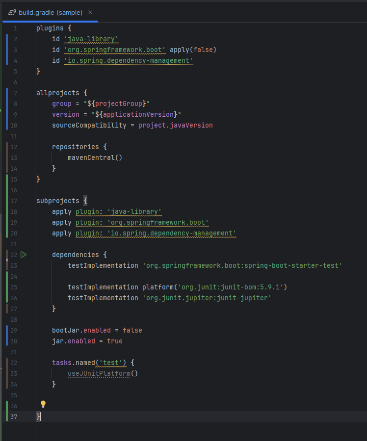
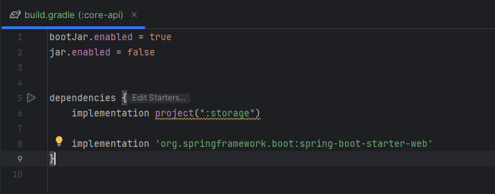
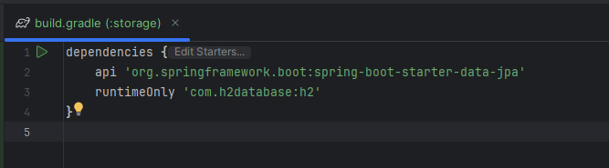

# Gradle 멀티 모듈 프로젝트

## 포스팅 환경
- Java 17
- SpringBoot 3.1.7
- Gradle - Groovy 8.5
- Spring Web
- H2
- Spring Data Jpa

## 0. 멀티 모듈 사용 이유

- 일반적으로 프로젝트 규모가 커지고 복잡해지는 경우 프로젝트를 '작고 상호의존적인 모듈'로 분할해서 관리하는 것이 좋습니다.
- 모듈 분리를 통해 의존성을 관리할 수 있습니다.

## 1. 프로젝트 구조

- root 프로젝트 / sub 프로젝트(모듈)로 구성
- root 프로젝트
    - build.gradle 에 root 모듈 설정한다.
    - settings.gradle 에 모든 하위 프로젝트를 포함해야한다.
- sub 프로젝트
    - 각각의 sub 모듈마다 build.gradle 파일을 만들고 설정한다.

```
├── .gradle
│   └── ⋮
├── gradle
│   └── wrapper
├── gradlew
├── gradlew.bat
├── settings.gradle (root 프로젝트 설정)
├── build.gradle (root 프로젝트 설정)
│
├── sub-project-1
│   └── build.gradle (sub 모듈 설정 파일)
│
└── sub-project-2
    └── build.gradle (sub 모듈 설정 파일)
```

## 2. 멀티 모듈 적용 해보기

### (1) 초기 상태

초기 상태 프로젝트 디렉토리 구조입니다. build.gradle 파일도 확인해보겠습니다.



[build.gradle]



### (2) 멀티 모듈 적용

간단하게 웹 계층을 담당하는 core-api 모듈,
DB에 접근하는 용도인 storage 모듈로 나눠서 적용해보겠습니다.

[github 에서 전체 소스 코드 확인하기](https://github.com/creatingeveryday/STUDY_REVIEW/tree/main/Gradle/gradle-multi-module-project)

#### [root 프로젝트 gradle.properties]

- gradle 설정 파일에서 사용할 환경변수를 정의하고 한 곳에서 편리하게 관리할 수 있다.



#### [root 프로젝트 settings.gradle]

- include 키워드를 통해 root 프로젝트가 하위 프로젝트(모듈)를 모두 관리하게 설정한다.
- 프로젝트 계층 구조는 ":" 으로 구분한다.



#### [root 프로젝트 build.gradle] root 프로젝트 build.gradle 설정 파일 추가

- 표준 Java 플러그인 대신 java-library 플러그인 적용
    - api 키워드를 사용하기 위해 java-library 플러그인 적용 [참고](https://docs.gradle.org/current/userguide/java_library_plugin.html)
    - 의존성 관리 키워드 api 와 implementation 차이점
      - api
        - 의존성을 다른 프로젝트와 공유한다는 의미로, 해당 의존성이 사용하는 모든 클래스와 리소스를 의존하는 프로젝트에 공유한다.
      - implementation
        - 의존성을 해당 프로젝트 내부에서만 사용한다는 의미로, 해당 의존성이 사용하는 모든 클래스와 리소스는 모듈 외부로 노출하지 않는다. 
- allprojects 블록
  - root 프로젝트를 포함한 모든 프로젝트에 적용되는 설정
- subprojects 블록
  - 하위 프로젝트에만 공통적으로 적용되는 설정
  - 하위 모듈은 단독으로 실행불가능한 모듈이므로 일괄적으로 jar 파일로 생성되게 설정한다. 
    - bootjar 를 생성해야하는 모듈에만 설정을 추가로 적용



#### [sub 프로젝트 core-api 모듈 build.gradle]

- web 계층(컨트롤러, 서비스, 도메인 클래스)
- 실행가능한 bootjar 생성한다.
- storage 모듈을 포함한다.



#### [sub 프로젝트 storage 모듈 build.gradle]

- db 접근계층(리포지토리, 엔티티 클래스)




참고해서 간단하게 멀티 모듈 설정을 적용해보았습니다.   

감사합니다.

## 참고

- [gradle.org](https://gradle.org/)
- [Gradle 멀티 프로젝트 관리](https://jojoldu.tistory.com/123)
- [지속 성장 가능한 소프트웨어를 만들어가는 방법](https://geminikims.medium.com/%EC%A7%80%EC%86%8D-%EC%84%B1%EC%9E%A5-%EA%B0%80%EB%8A%A5%ED%95%9C-%EC%86%8C%ED%94%84%ED%8A%B8%EC%9B%A8%EC%96%B4%EB%A5%BC-%EB%A7%8C%EB%93%A4%EC%96%B4%EA%B0%80%EB%8A%94-%EB%B0%A9%EB%B2%95-97844c5dab63)